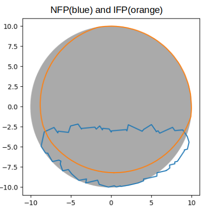
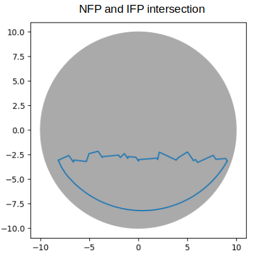
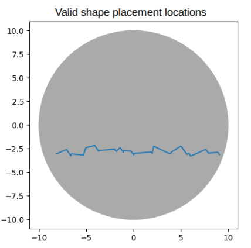
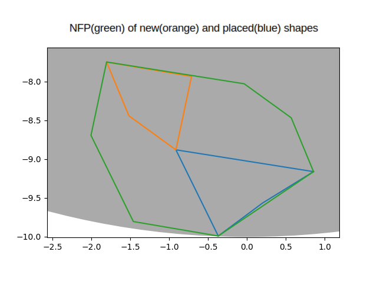
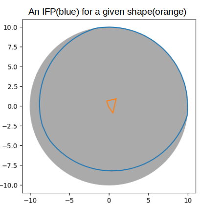

# Crystal sorting - Dan Riley

## Step 1 - Finding suitable locations to place a shape

The main idea is to find a border(s) where a new shape would touch but not intersect already placed shapes. The "border" is called a No-Fit Polygon(NFP). A new shape also has to be inside of the circle which requires to calculate another "border" beyond which a shape cannot be placed - an Inner-Fit Polygon(IFP).

Now an intersection of the NFP and IFP is computed. Computation of the intersection is handled by the *shapely* library. The intersection contains parts that belong to the IFP or the NFP.

The parts that belong only to the IFP are removed as they are not valid placements. The rest are valid positions to place a shape and are passed on to **Step 2**.

### No-Fit Polygon

An NFP is the result of sliding one shape by one of its vertices(The highest vertex of a shape was used for clarity) aroud the other shape so that the shapes touch but not intersect. The shapes are not rotated in any way during the sliding. The path of the vertex is the resulting NFP. The NFP is computed as follows:

1. Edges of both shapes are translated to vectors
2. The vectors are sorted by their angle
3. The vectors are connected to each other according to their order to output the resulting NFP

Both of the shapes must be convex. If that is not the case, their convex hull is used.

This works only for two shapes. To get an NFP of all placed shapes and a new shape, an NFP is constructed for each placed shape and the new shape. Then a union of all of the single NFPs is constructed. This is handled again by the *shapely* library The union is the NFP of all placed shapes as a whole and of the new shape.

### Inner-Fit Polygon

An IFP is the result of sliding a shape by one of its vertices(again, its highest point was used) around the inside of a shape, in this case a circle, such that the shape touches the cicle's edge but does not exit the circle even by a small bit. The shape is not rotated in any way during the sliding. The IFP is constructed in the following way:

1. A shape is placed to the edge of the circle(= one of its vertices is touching the edge)
2. The shape is slid counterclockwise in a given direction as far as possible(until it touches the edge)
3. The shape's direction is moved counterclockwise by a few degrees
4. Repeat steps 2 and 3 until the shape returns to its starting position

To slide the shape, the distance to contact with the circle under the shape's direction is computed. Then the shape is moved in the direction by the computed distance. To do that, a distance for every vertex to the edge of the circle under the direction has to be computed. The lowest distance of all vertices is then taken.

## Step 2 - Picking the best location to place the shape

Now, that a list of valid locations for the shape is available, a decision which location to pick must be made. I used a simple heuristic - the lowest possible location. This enables shapes to fill holes between already placed shapes and usually results in compact placement of random shapes.

### Multiple rotations

If it is possible to rotate the shape, for each orientation of the shape a lowest point is found. Then the overall lowest point and its corresponding orientation of the shape is used.